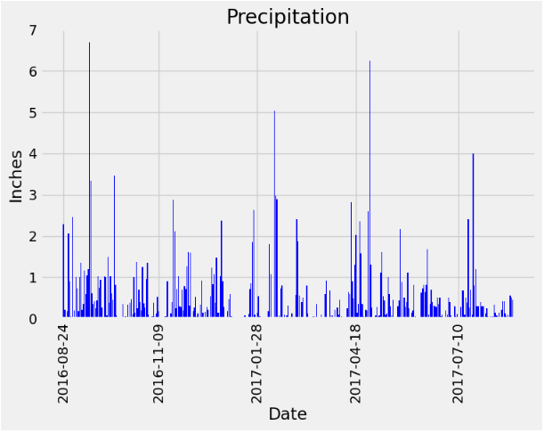
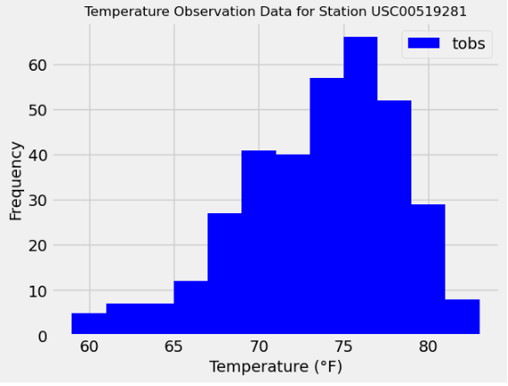
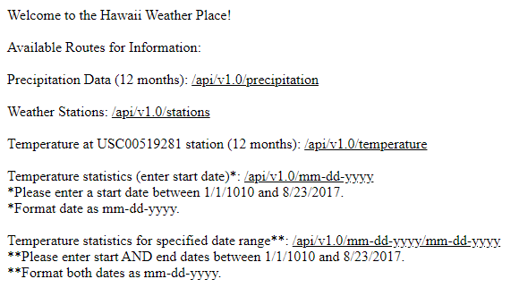

UCB Data Analysis Bootcamp Module 10
### SQLAlchemy Challenge - Climate Data Analysis w/Flask API and SQLite

---------------
#### Purpose:
Analyze data collected from weather stations in Hawaii between 2010 and 2017. Plot precipitation and temperature and then generate a Flask API using established data queries.  

**Part 1: Analyze and Explore Climate Data**  
1. Prepare data for evaluation.
   1. Use SQLAlchemy (create_engine) to connect climate data to a SQLite database.  
     ```
     # create engine to hawaii.sqlite
     engine = create_engine("sqlite:///Resources/hawaii.sqlite")
     ```
   2. Use SQLAlchemy (automap_base) function to reflect tables into classes.
     ```
     # reflect an existing database into a new model
     Base = automap_base()
      
     # reflect the tables
     Base.prepare(autoload_with=engine)
     ```
   3. Link Python to the SQLite database by creating a SQLAlchemy session.
     ```
     # Create our session (link) from Python to the DB
     session = Session(engine)
     ```

2. Plot precipitation for the most recent year of data (12 months) based upon the last recorded date in the dataset.
     ```
     # Find the most recent date in the data set.
     import datetime as dt
     newest = session.query(Measure.date).order_by(Measure.date.desc()).first()
     newest = newest[0]
  
     # Calculate the date one year prior to 'newest'.
     yr_prior = dt.date(2017, 8, 23) - dt.timedelta(days=365)
  
     # Find all dates greater than 'yr_prior'.
     yr_prior_dt = dt.date(2016, 8, 23)
     qdata = session.query(Measure.date, Measure.station, Measure.prcp, Measure.tobs).filter(Measure.date > yr_prior_dt).all()
  
     # Save query results as pandas dataFrame.
     qdata_df = pd.DataFrame(qdata, columns=['date', 'station', 'prcp', 'tobs'])
      
     # Sort by date.
     qdata_df = qdata_df.sort_values("date")
      
     # Filter out all rows with a prcp value of "none".
     qdata_df = qdata_df.dropna(subset=['prcp'])
      
     # Reset the index
     qdata_df = qdata_df.reset_index(drop=True)
     ```

      

NOTE: My summary statistics of the precipitation data strays from the values provided in the starter code notebook because I opted to filter out all rows where 'prcp' = "none".  I believe this yields a technically superior analysis.  

3. Station Analysis (now focusing on 'station' class)
   1. Multiple steps omitted. See notebook (climate_starter_rjh.ipynb) for details.
   2. Design a query to return the previous 12 months of temp observation (TOBS) data and plot the result.

     ```
     # Query the last 12 months of temperature observation data for this station and plot the results as a histogram
     stn_qdata = session.query(Measure.tobs).filter(Measure.station == "USC00519281").filter(Measure.date > yr_prior_dt).all()
      
     # Extract the temperatures from the query results
     stn_temps = [result[0] for result in stn_qdata]
      
     # Plot the results as a histogram
     plt.hist(stn_temps, bins=12, alpha=1, color='b')
     plt.title("Temperature Observation Data for Station USC00519281", fontsize=12)
     plt.xlabel("Temperature (°F)", fontsize=14)
     plt.ylabel("Frequency", fontsize=14)
     plt.legend(['tobs'], loc='upper right')
     plt.show()
     ```

      

**Part 2: Create a Flask API using queries established in Part 1**  

  

--------------
#### Contents of Repository:
- FOLDER: HI_Climate
  - 1 x Jupyter notebook:  climate_starter_rjh.ipynb
  - 1 x Python file:  app_rjh.py
  - FOLDER: Resources
      - 2 x .csv source data files
      - 1 x .sqlite data file for import (hawaii.sqlite)
- README file

-------------------
#### Contributions:
N/A

------------------
#### License:
[MIT](https://choosealicense.com/licenses/mit/)
